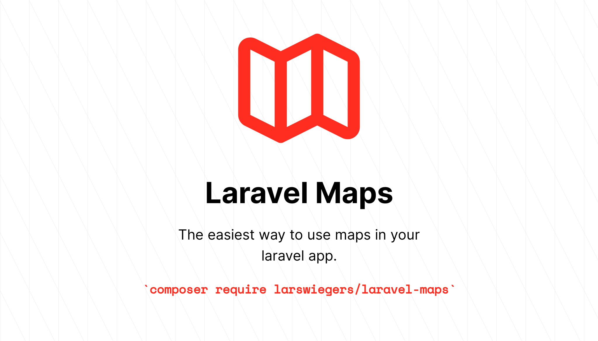

# What I learned after maintaining my first package for 8 months
## What is the package?
About eight months ago I released my package Laravel-maps, the goals was to create a better experience for people that want to use maps in their website / webapp. By creating blade components that can easily be used. Currently it supports leaflet.js and google maps.

## What happened since?
The first release of laravel-maps ( https://github.com/LarsWiegers/laravel-maps ) was on 26 of May 2021. Since that 9 more versions have been released and the package has been downloaded over 3600 times. That's freaking amazing. I am actually amazed that 3600+ people thought the package was worth their time and wanted to try / use it in their apps / websites.

## Issues
In total 13 issues have been created by users. Which was awesome, as I had not really had the experience of being a maintainer for an open

## Downloads over time
The install statistics.

Source: https://packagist.org/packages/larswiegers/laravel-maps/stats

## Forks
It is weird seeing people forking the repository and then not changing anything. Why do people do this?

Is it like a backup of the dependency so that if it disapears they can use that version?

## Time spent
After the main development of the package, the time requirements were really low. It takes me maybe 30 minutes per 2 weeks to maintain the package.

Why im scared to release a v1.0
Releasing a v1 would be cool. But what if something brakes? You would immediatly have to release a v1.1. That would look bad. It also kinda makes this thing official and says "This package works and you should be able to use it". The current version system v0.* makes it easy for me to still change the syntax. This causes some stress.

## Getting feedback
Seeing people create issues was awesome as it meant they were actually using the package. Some quotes from people in the issues:

"Awesome. Works on my end!"
"This is a very good solution actually. Thank you very much! You made my day :)"
"Hi @LarsWiegers I would've done it exactly the same way. I haven't tested it myself, but it looks as one (or at least I) would expect. :-)"
I would love to see where it was being used on what pages / webapps. I can't currently do that and it sucks. Sure downloads are a good indicator if something is being used but actually getting analytics or something would be awesome. I wonder how other open source developers think about this? Maybe i can include like a ping back in the package if people enable it. (would obviously be not enabled by default). Let me know what you think about that.

## What am i working on next?

Im working on a new package, sneak peek here: https://github.com/LarsWiegers/laravel-translations-checker. It allows you to not worry about the translations in your application. I have often published to production and then saw missing translations. That sucks and this package should take that worry away.

Have any feedback feel free to email me at: larswiegers@live.nl or send me a message on twitter @larswiegers is my handle.

